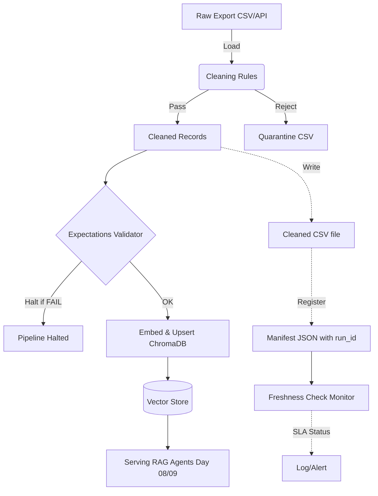

# Kiến trúc pipeline — Lab Day 10

**Nhóm:** Nhóm C401-B6  
**Cập nhật:** 15/04/2026

---

## 1. Sơ đồ luồng (bắt buộc có 1 diagram: Mermaid / ASCII)

---

## 2. Ranh giới trách nhiệm

| Thành phần | Input | Output | Owner nhóm (Theo Sprint) |
|------------|-------|--------|---------------------------|
| Ingest | File raw CSV (`data/raw/`) | In-memory List of Dictionaries | Ingestion Owner (Sprint 1) |
| Transform | In-memory Dicts | `cleaned_records`, file `quarantine.csv` | Cleaning Owner (Sprint 1, 2) |
| Quality | `cleaned_records` | Expectation log, Halt signal | Quality Owner (Sprint 2, 3) |
| Embed | `cleaned.csv` | Vector Embeddings (ChromaDB) | Embed Owner (Sprint 2, 3) |
| Monitor | `manifest.json` | Freshness check PASS/FAIL/WARN log | Monitoring Owner (Sprint 4) |

---

## 3. Idempotency & rerun

- **Cơ chế Upsert:** Pipeline đảm bảo tính lũy đẳng (idempotent) thông qua việc sử dụng hàm `_stable_chunk_id` (hash bộ mã `doc_id` + `chunk_text` + `seq`). Khi ghi vào ChromaDB, hệ thống gọi lệnh `upsert` theo `chunk_id`. 
- **Chống trùng lặp (Duplicate):** Nhờ cơ chế hash này, nếu chạy lại (rerun) cùng một dataset 10 lần thì ChromaDB vẫn không bị duplicate record. 
- **Prune stale data:** Hệ thống lấy snapshot `id` của mẻ dữ liệu sạch hiện tại và xóa (delete) những vector ID rác cũ còn tồn đọng trong DB, giữ vector store luôn đồng bộ chính xác 1:1 với bản Export mới nhất.

---

## 4. Liên hệ Day 09

- Pipeline này đóng vai trò cung cấp "nguồn sự thật" (Source of Truth) dạng Vector Store cho các LLM Agent của Lab Day 09.
- Nếu không có luồng chặn Expectation tại đây, các Worker Agent bên Day 09 sẽ truy xuất nhầm policy 14 ngày hoặc policy nghỉ phép quá hạn, dẫn đến việc Agent trích xuất câu trả lời sai lệch gây thiệt hại (hành vi Hallucination từ Bad Data).

---

## 5. Rủi ro đã biết

- Schemas đầu vào từ hệ thống nguồn thay đổi đột ngột (đổi tên cột CSV) làm gãy luồng Ingest.
- Model Embedding `all-MiniLM-L6-v2` phụ thuộc vào mạng HuggingFace, có thể timeout khi deploy.
- Freshness check có thể cảnh báo giả (False Positive) nếu job cronjob sinh raw file bị delay một vài phút nhưng chưa vi phạm lỗi nghiệp vụ.
